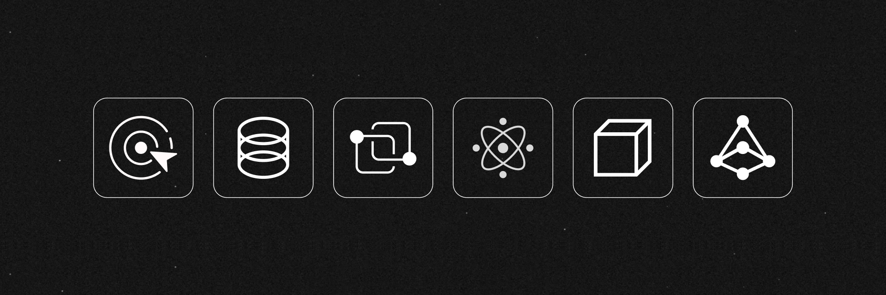

# Hello! I am Nika.

Ph.D. student in **applied mathematics**.
3+ years of professional experience as a **software developer**.
Expert in **algorithms and data structures**.
Proficient in **Python** and **C++**.
Knowledgeable about **Rust** and **Java**.
Experienced in **database management**, **data analytics**, and **quality assurance**.

- 🔭 I am currently working on a data structure in C++ and a password manager in Rust
- 🌱 I am currently learning SQL window functions and various DevOps tools
- 👯 I am looking to collaborate on open-source data analytics projects in Python
- 😀 I like making videos, watching anime, and playing video games in my free time
- 💬 Ask me about robust combinatorial optimization and cryptographic protocols
- 🥅 2023 Goals: publish an article, release 3 projects, solve all LeetCode problems
- ✨ Fun fact: I once learned to type at 120 WPM only to forget it all months later

## Competitive Programming

I love solving algorithmic puzzles in a time-constrained manner. Here are some of my [stats](https://clist.by/coder/Sky_Nik/):

To get started with competitive programming, check out [CSES Problem Set](https://cses.fi/problemset/), [USACO Guide](https://usaco.guide/), [Competitive Programmer's Handbook](https://cses.fi/book/book.pdf), and either [AtCoder Library](https://github.com/atcoder/ac-library) or [PyRival](https://github.com/cheran-senthil/PyRival). For additional resources, take a look at this [list](https://github.com/stars/nskybytskyi/lists/competitive-programming).

## Socials

I have two YouTube channels where I share educational videos in [Ukrainian](https://youtube.com/@leetcodeukraine) and [English](https://youtube.com/@nskybytskyi).

